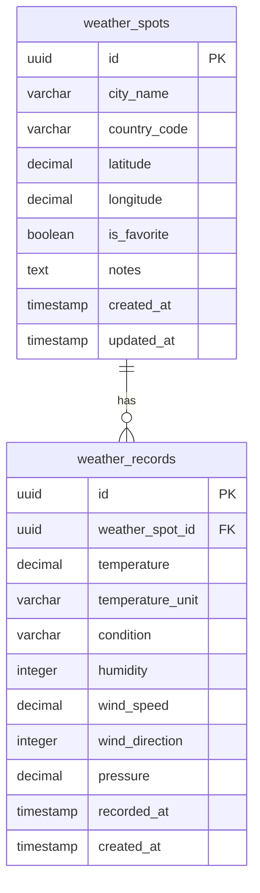

# Weather Mapper - Database Schema Visualization

## Entity Relationship Diagram



## Database Schema Details

### Table: `weather_spots`

**Purpose**: Stores user-tracked cities/locations for weather monitoring.

**Columns**:

| Column Name | Data Type | Constraints | Description |
|------------|-----------|-------------|-------------|
| `id` | UUID | PRIMARY KEY, NOT NULL | Unique identifier for each weather spot |
| `city_name` | VARCHAR(255) | NOT NULL | Name of the city (e.g., "San Francisco") |
| `country_code` | VARCHAR(2) | NULL | ISO 3166-1 alpha-2 country code (e.g., "US", "GB") |
| `latitude` | DECIMAL(10, 8) | NOT NULL | Latitude coordinate (-90 to 90) |
| `longitude` | DECIMAL(11, 8) | NOT NULL | Longitude coordinate (-180 to 180) |
| `is_favorite` | BOOLEAN | NOT NULL, DEFAULT false | Whether the spot is marked as favorite |
| `notes` | TEXT | NULL | User-provided notes about the city |
| `created_at` | TIMESTAMP WITH TIME ZONE | NOT NULL, DEFAULT NOW() | When the spot was created |
| `updated_at` | TIMESTAMP WITH TIME ZONE | NOT NULL, DEFAULT NOW() | When the spot was last updated |

**Indexes**:
- Primary Key: `id`
- Index: `idx_weather_spots_favorite` on `is_favorite` (for filtering favorites)
- Index: `idx_weather_spots_location` on `(latitude, longitude)` (for geospatial queries)
- Index: `idx_weather_spots_created_at` on `created_at` (for sorting)

**Example Data**:
```sql
INSERT INTO weather_spots (id, city_name, country_code, latitude, longitude, is_favorite, notes)
VALUES (
  'a1b2c3d4-e5f6-7890-abcd-ef1234567890',
  'San Francisco',
  'US',
  37.7749,
  -122.4194,
  true,
  'My favorite city!'
);
```

---

### Table: `weather_records`

**Purpose**: Stores historical weather data for each tracked spot.

**Columns**:

| Column Name | Data Type | Constraints | Description |
|------------|-----------|-------------|-------------|
| `id` | UUID | PRIMARY KEY, NOT NULL | Unique identifier for each weather record |
| `weather_spot_id` | UUID | FOREIGN KEY, NOT NULL | Reference to `weather_spots.id` |
| `temperature` | DECIMAL(5, 2) | NOT NULL | Temperature value (e.g., 18.50) |
| `temperature_unit` | VARCHAR(1) | NOT NULL, DEFAULT 'C' | Unit: 'C' (Celsius) or 'F' (Fahrenheit) |
| `condition` | VARCHAR(50) | NOT NULL | Weather condition description (e.g., "Partly Cloudy", "Sunny") |
| `humidity` | INTEGER | NULL | Humidity percentage (0-100) |
| `wind_speed` | DECIMAL(5, 2) | NULL | Wind speed (km/h or mph) |
| `wind_direction` | INTEGER | NULL | Wind direction in degrees (0-360, where 0 is North) |
| `pressure` | DECIMAL(7, 2) | NULL | Atmospheric pressure in hPa (hectopascals) |
| `recorded_at` | TIMESTAMP WITH TIME ZONE | NOT NULL | When the weather data was recorded (from API) |
| `created_at` | TIMESTAMP WITH TIME ZONE | NOT NULL, DEFAULT NOW() | When the record was created in database |

**Indexes**:
- Primary Key: `id`
- Foreign Key: `weather_spot_id` → `weather_spots.id` ON DELETE CASCADE
- Index: `idx_weather_records_spot_id` on `weather_spot_id` (for joining)
- Index: `idx_weather_records_recorded_at` on `recorded_at` (for time-based queries)
- Composite Index: `idx_weather_records_spot_recorded` on `(weather_spot_id, recorded_at DESC)` (for efficient history queries)

**Example Data**:
```sql
INSERT INTO weather_records (
  id, 
  weather_spot_id, 
  temperature, 
  temperature_unit, 
  condition, 
  humidity, 
  wind_speed, 
  wind_direction, 
  pressure, 
  recorded_at
)
VALUES (
  'b2c3d4e5-f6a7-8901-bcde-f12345678901',
  'a1b2c3d4-e5f6-7890-abcd-ef1234567890',
  18.50,
  'C',
  'Partly Cloudy',
  75,
  15.00,
  270,
  1012.50,
  '2024-01-15 10:30:00+00'
);
```

---

## Relationships

### One-to-Many: `weather_spots` → `weather_records`

- One weather spot can have many weather records (historical data)
- When a weather spot is deleted, all associated weather records are automatically deleted (CASCADE)
- Foreign key constraint ensures data integrity

**Query Example**:
```sql
-- Get all weather records for a specific spot
SELECT wr.*
FROM weather_records wr
WHERE wr.weather_spot_id = 'a1b2c3d4-e5f6-7890-abcd-ef1234567890'
ORDER BY wr.recorded_at DESC
LIMIT 7;
```

---

## Common Queries

### Get all spots with latest weather
```sql
SELECT 
  ws.*,
  wr.temperature,
  wr.condition,
  wr.recorded_at as last_weather_update
FROM weather_spots ws
LEFT JOIN LATERAL (
  SELECT temperature, condition, recorded_at
  FROM weather_records
  WHERE weather_spot_id = ws.id
  ORDER BY recorded_at DESC
  LIMIT 1
) wr ON true
ORDER BY ws.created_at DESC;
```

### Get weather history for a spot (last 7 days)
```sql
SELECT 
  temperature,
  condition,
  humidity,
  wind_speed,
  recorded_at
FROM weather_records
WHERE weather_spot_id = 'a1b2c3d4-e5f6-7890-abcd-ef1234567890'
  AND recorded_at >= NOW() - INTERVAL '7 days'
ORDER BY recorded_at ASC;
```

### Get favorite spots with current weather
```sql
SELECT 
  ws.*,
  wr.temperature,
  wr.condition
FROM weather_spots ws
LEFT JOIN LATERAL (
  SELECT temperature, condition
  FROM weather_records
  WHERE weather_spot_id = ws.id
  ORDER BY recorded_at DESC
  LIMIT 1
) wr ON true
WHERE ws.is_favorite = true
ORDER BY ws.city_name;
```

---

## Database Constraints

### Check Constraints
- `latitude` BETWEEN -90 AND 90
- `longitude` BETWEEN -180 AND 180
- `humidity` BETWEEN 0 AND 100 (if not NULL)
- `wind_direction` BETWEEN 0 AND 360 (if not NULL)
- `temperature_unit` IN ('C', 'F')

### Foreign Key Constraints
- `weather_records.weather_spot_id` → `weather_spots.id` ON DELETE CASCADE

### Unique Constraints
- None (multiple records per spot are expected)

---

## Supabase Setup SQL

```sql
-- Enable UUID extension
CREATE EXTENSION IF NOT EXISTS "uuid-ossp";

-- Create weather_spots table
CREATE TABLE weather_spots (
  id UUID PRIMARY KEY DEFAULT uuid_generate_v4(),
  city_name VARCHAR(255) NOT NULL,
  country_code VARCHAR(2),
  latitude DECIMAL(10, 8) NOT NULL CHECK (latitude BETWEEN -90 AND 90),
  longitude DECIMAL(11, 8) NOT NULL CHECK (longitude BETWEEN -180 AND 180),
  is_favorite BOOLEAN NOT NULL DEFAULT false,
  notes TEXT,
  created_at TIMESTAMP WITH TIME ZONE NOT NULL DEFAULT NOW(),
  updated_at TIMESTAMP WITH TIME ZONE NOT NULL DEFAULT NOW()
);

-- Create weather_records table
CREATE TABLE weather_records (
  id UUID PRIMARY KEY DEFAULT uuid_generate_v4(),
  weather_spot_id UUID NOT NULL REFERENCES weather_spots(id) ON DELETE CASCADE,
  temperature DECIMAL(5, 2) NOT NULL,
  temperature_unit VARCHAR(1) NOT NULL DEFAULT 'C' CHECK (temperature_unit IN ('C', 'F')),
  condition VARCHAR(50) NOT NULL,
  humidity INTEGER CHECK (humidity BETWEEN 0 AND 100),
  wind_speed DECIMAL(5, 2),
  wind_direction INTEGER CHECK (wind_direction BETWEEN 0 AND 360),
  pressure DECIMAL(7, 2),
  recorded_at TIMESTAMP WITH TIME ZONE NOT NULL,
  created_at TIMESTAMP WITH TIME ZONE NOT NULL DEFAULT NOW()
);

-- Create indexes
CREATE INDEX idx_weather_spots_favorite ON weather_spots(is_favorite);
CREATE INDEX idx_weather_spots_location ON weather_spots(latitude, longitude);
CREATE INDEX idx_weather_spots_created_at ON weather_spots(created_at);

CREATE INDEX idx_weather_records_spot_id ON weather_records(weather_spot_id);
CREATE INDEX idx_weather_records_recorded_at ON weather_records(recorded_at);
CREATE INDEX idx_weather_records_spot_recorded ON weather_records(weather_spot_id, recorded_at DESC);

-- Create function to update updated_at timestamp
CREATE OR REPLACE FUNCTION update_updated_at_column()
RETURNS TRIGGER AS $$
BEGIN
  NEW.updated_at = NOW();
  RETURN NEW;
END;
$$ LANGUAGE plpgsql;

-- Create trigger for updated_at
CREATE TRIGGER update_weather_spots_updated_at
  BEFORE UPDATE ON weather_spots
  FOR EACH ROW
  EXECUTE FUNCTION update_updated_at_column();
```

---

## Data Flow Visualization

```
┌─────────────────────────────────────────────────────────┐
│                    weather_spots                         │
│  ┌──────────┐  ┌──────────────┐  ┌──────────────┐     │
│  │ id (PK)  │  │ city_name     │  │ coordinates  │     │
│  │          │  │ country_code  │  │ is_favorite  │     │
│  │          │  │ notes         │  │ timestamps   │     │
│  └────┬─────┘  └──────────────┘  └──────────────┘     │
└───────┼─────────────────────────────────────────────────┘
        │
        │ 1:N relationship
        │ (CASCADE DELETE)
        │
        ▼
┌─────────────────────────────────────────────────────────┐
│                  weather_records                        │
│  ┌──────────┐  ┌──────────────┐  ┌──────────────┐     │
│  │ id (PK)  │  │ spot_id (FK) │  │ temperature  │     │
│  │          │  │ condition    │  │ humidity     │     │
│  │          │  │ wind data    │  │ pressure     │     │
│  │          │  │ recorded_at  │  │ timestamps   │     │
│  └──────────┘  └──────────────┘  └──────────────┘     │
└─────────────────────────────────────────────────────────┘
```

---

## Notes

- **UUIDs**: Using UUIDs for primary keys provides better scalability and avoids ID enumeration attacks
- **Timestamps**: Using `TIMESTAMP WITH TIME ZONE` ensures proper timezone handling
- **CASCADE Delete**: Deleting a spot automatically removes all its weather records
- **Indexes**: Optimized for common query patterns (favorites, location, history)
- **Normalization**: Weather data is normalized to avoid duplication
- **Flexibility**: Optional fields allow for different weather API responses

